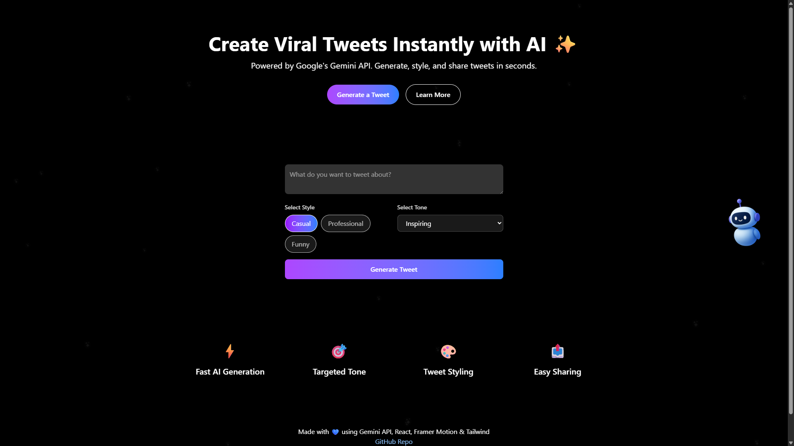

# 🚀 AI Twitter Post Generator

A sleek, modern web application that leverages **Google's Gemini API** to generate AI-powered viral tweets instantly. Built with **React.js**, **Framer Motion**, and **TailwindCSS**, this app delivers a dynamic and animated user experience — themed around Twitter (X) aesthetics.

---

## ✨ Features

- **🧠 AI-Powered Tweet Generation**  
  Generate tweets in under 280 characters using Google Gemini API with customizable **styles** (Casual, Professional, Funny) and **tones** (Inspiring, Witty, Concise, Bold).

- **🎨 Animated UI**  
  Smooth animations with Framer Motion — glowing stars during generation, draggable robot, confetti on success, and more!

- **🌓 Light & Dark Mode Toggle**  
  Switch between themes with a single click for optimal accessibility.

- **📱 Responsive Design**  
  Optimized layout across all devices using TailwindCSS utility classes.

- **🎯 Tweet Preview & Actions**  
  View tweets in a Twitter-style card with actions to **copy** or **regenerate**.

---

## 🛠️ Technologies Used

| Tech            | Purpose                          |
|----------------|----------------------------------|
| React.js        | Frontend Framework               |
| Framer Motion   | UI Animation                     |
| TailwindCSS     | Utility-first Styling            |
| Google Gemini   | AI Tweet Generation              |
| Axios           | API Requests                     |
| JSConfetti      | Confetti Animation               |

---

## 📁 Folder Structure

```
AI_TWITTER_POST_GENERATOR/
├── node_modules/
├── public/
├── src/
│   ├── components/
│   └── App.jsx
├── .env
├── .gitignore
├── index.html
├── package.json
├── vite.config.js
```

---

## 📦 Setup Instructions

### ⚙️ Prerequisites

- Node.js v16+
- npm or yarn
- Google Gemini API Key (from [Google AI Studio](https://makersuite.google.com/))

### 🚀 Installation

```bash
git clone https://github.com/your-username/ai-twitter-post-generator.git
cd ai-twitter-post-generator
npm install
```

### 🔑 Environment Variables

Create a `.env` file in the root directory:

```
VITE_GEMINI_API_KEY=your-gemini-api-key-here
```

### ▶️ Start the Development Server

```bash
npm run dev
```

Visit: [http://localhost:5173](http://localhost:5173)

---

## 📝 Usage

### 🧾 Generate a Tweet

1. Type a topic into the input box.
2. Choose a **style** and **tone**.
3. Click **"Generate Tweet"**.
4. Enjoy the visual effects — glowing stars and confetti on success.

### 🔁 Interact with Your Tweet

- **Copy** to clipboard.
- **Regenerate** a fresh version.
- Use the **theme toggle** (🌙 / ☀️) for dark/light mode.

---

## 🖼️ Screenshots

> 

---

## 🤝 Contributing

Contributions are welcome! 🚀

```bash
git checkout -b feature/your-feature-name
# Make your changes
git commit -m "Add: your feature description"
git push origin feature/your-feature-name
```

Then open a pull request 🙌

---

## 📜 License

Licensed under the [MIT License](LICENSE).

---

## 🙌 Acknowledgments

- [Google Gemini API](https://ai.google.dev/)
- [Framer Motion](https://www.framer.com/motion/)
- [TailwindCSS](https://tailwindcss.com/)
- [JSConfetti](https://github.com/loonywizard/js-confetti)

---

## 🌐 Portfolio

Made with 💙 by **Subhra Sundar Sinha**  
🔗 [Visit My Portfolio](https://subhrasundar.vercel.app/)
